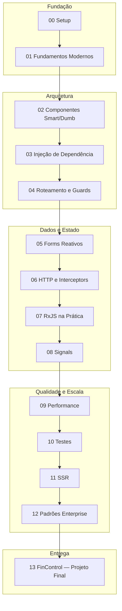

# Roadmap Visual — Angular Architect

## Marcos de competência

| Marco | Após módulo | Você consegue... |
|-------|-------------|------------------|
| 🟢 Junior+ | 04 | Estruturar features com rotas lazy e guards |
| 🟡 Pleno | 08 | Combinar RxJS + Signals sem vazamento de memória |
| 🟠 Pleno+ | 10 | Entregar código com testes e OnPush |
| 🔴 Sênior | 13 | Projetar e entregar app enterprise completo |

## Ritmo sugerido

- **Intensivo (4 semanas):** 20h/semana
- **Moderado (8 semanas):** 10h/semana
- **Leve (16 semanas):** 5h/semana

Revise cada módulo com o mentor: envie código, receba nota e refatoração.
