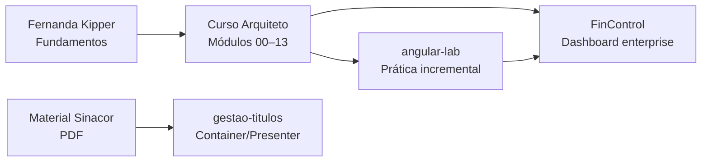

# Estudos Angular

> Trilha pessoal de estudos em **Angular 21+** — do primeiro app à arquitetura enterprise e padrões corporativos (Sinacor).

[](https://angular.dev)
[](https://www.typescriptlang.org/)
[](https://angular.dev/guide/components)
[](https://angular.dev/guide/signals)

---

## Visão geral

Este repositório reúne **cursos**, **laboratórios** e **projetos de portfólio** em uma jornada contínua:



| Trilha | Objetivo | Quando usar |
|--------|----------|-------------|
| Introdução | Sintaxe, CLI, primeiro app | Nunca viu Angular |
| Arquiteto | Smart/Dumb, DI, HTTP, testes, SSR | Já sabe o básico |
| Projetos | Portfólio e padrão corporativo | Consolidar e mostrar trabalho |

---

## Estrutura do repositório

```
Estudos-AngularJS/
├── Curso-de-Angular-FernandaKipper/   # Curso introdutório
│   └── meu-primeiro-app/
├── Curso- Arquiteto-de-Angular/       # Curso completo (14 módulos)
│   ├── 00-setup-e-ambiente/ … 13-projeto-final-fincontrol/
│   └── rascunho/angular-lab/          # Lab em evolução (módulos 00–12)
└── Projetos/                          # Apps standalone de portfólio
    ├── FinControl/                    # Dashboard financeiro (módulo 13)
    └── gestao-titulos/                # Exercício Sinacor (Material.pdf)
```

---

## Por onde começar?

> **Treino para reunião / entrevista:** [QUESTIONARIO-TREINO.md](./QUESTIONARIO-TREINO.md) — 75 perguntas (blocos 1–8), incluindo bloco sênior de caça-falhas.

### Iniciante

1. [Curso Fernanda Kipper](./Curso-de-Angular-FernandaKipper/meu-primeiro-app/) — primeiro app
2. [Curso Arquiteto — módulo 00](./Curso-%20Arquiteto-de-Angular/00-setup-e-ambiente/) — setup e estrutura
3. Módulos **01 → 04** do Arquiteto (fundamentos → rotas)

### Já fez o básico

1. [Curso Arquiteto — README](./Curso-%20Arquiteto-de-Angular/README.md)
2. [COMO-ESTUDAR.md](./Curso-%20Arquiteto-de-Angular/COMO-ESTUDAR.md) — fluxo de cada módulo
3. Prática em [`rascunho/angular-lab/`](./Curso-%20Arquiteto-de-Angular/rascunho/angular-lab/)

### Foco corporativo (Sinacor)

1. Estudar módulos **02, 03, 06, 08** do Arquiteto (componentes, DI, HTTP, signals)
2. Implementar [Gestão de Títulos](./Projetos/gestao-titulos/) — exercício do Material.pdf

---

## Projetos

| Projeto | Descrição | Comando |
|---------|-----------|---------|
| [**angular-lab**](./Curso-%20Arquiteto-de-Angular/rascunho/angular-lab/) | Lab incremental dos módulos 00–12: catalog, auth, facade, RxJS, testes | `cd Curso-\ Arquiteto-de-Angular/rascunho/angular-lab && ng serve` |
| [**FinControl**](./Projetos/FinControl/) | Dashboard de finanças — feature-based, mock API, guards, KPIs | `cd Projetos/FinControl && ng serve` |
| [**gestao-titulos**](./Projetos/gestao-titulos/) | Sinacor Eleva Cloud — Container/Presenter, state global, CSV | `cd Projetos/gestao-titulos && ng serve` → `/gestao-titulos` |

### Credenciais demo (FinControl / angular-lab)

Qualquer e-mail válido + senha com **3+ caracteres** (ex.: `dev@test.com` / `123`).

---

## Stack

| Tecnologia | Uso |
|------------|-----|
| **Angular 21+** | Framework principal |
| **Standalone Components** | Sem NgModules |
| **Signals + computed** | Estado reativo e KPIs |
| **RxJS** | HTTP, debounce, `switchMap` |
| **Reactive Forms** | Login, produtos, transações |
| **HttpInterceptor** | Mock API, auth, erros |
| **Vitest** | Testes unitários |
| **Angular Material** | UI no `gestao-titulos` |
| **SCSS** | Estilos |

---

## Padrões que você vai encontrar

| Padrão | Onde aparece |
|--------|----------------|
| Smart / Dumb (`pages` + `ui`) | `angular-lab`, FinControl |
| Container / Presenter | `gestao-titulos` (Sinacor) |
| Facade + API | `ProductFacade`, `TransactionFacade`, `TituloService` |
| State com `_data` + `asReadonly()` | `TituloStateService`, `CatalogStore` |
| Guards + lazy routes | Todos os apps |
| OnPush nos dumb | Regra em todo o curso |

---

## Curso Arquiteto — roadmap rápido

| # | Módulo | Tema |
|---|--------|------|
| 00 | Setup | Estrutura `core` / `features` / aliases |
| 01 | Fundamentos | Signals, standalone, playground |
| 02 | Componentes | Smart/Dumb, OnPush |
| 03 | DI | `inject()`, tokens, services |
| 04 | Rotas | Guards, lazy load |
| 05 | Forms | Reactive forms |
| 06 | HTTP | Interceptors, facade |
| 07 | RxJS | debounce, `switchMap`, teardown |
| 08 | Signals | Store, computed |
| 09 | Performance | `@defer`, auditoria OnPush |
| 10 | Testes | Vitest, dumb + services |
| 11 | SSR | `PLATFORM_ID`, localStorage seguro |
| 12 | Enterprise | ADRs, documentação |
| 13 | FinControl | Projeto final portfólio |

Roadmap completo: [Curso Arquiteto — README](./Curso-%20Arquiteto-de-Angular/README.md)

---

## Comandos úteis

```bash
# Instalar CLI global (uma vez)
npm install -g @angular/cli

# Qualquer projeto
npm install
ng serve          # dev → http://localhost:4200
ng build          # produção
ng test           # testes (Vitest)
```

---

## Recursos oficiais

- [Angular Docs](https://angular.dev)
- [Angular Style Guide](https://angular.dev/style-guide)
- [RxJS](https://rxjs.dev)

---

## Autor

**Thiago Matos Tertuliano** — estudos para evolução de iniciante a perfil **Angular Architect** (enterprise + corporativo).
